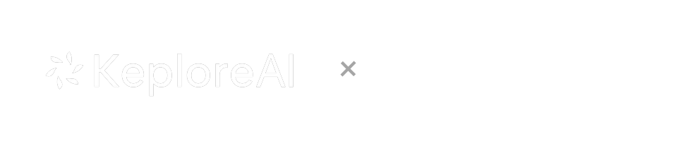
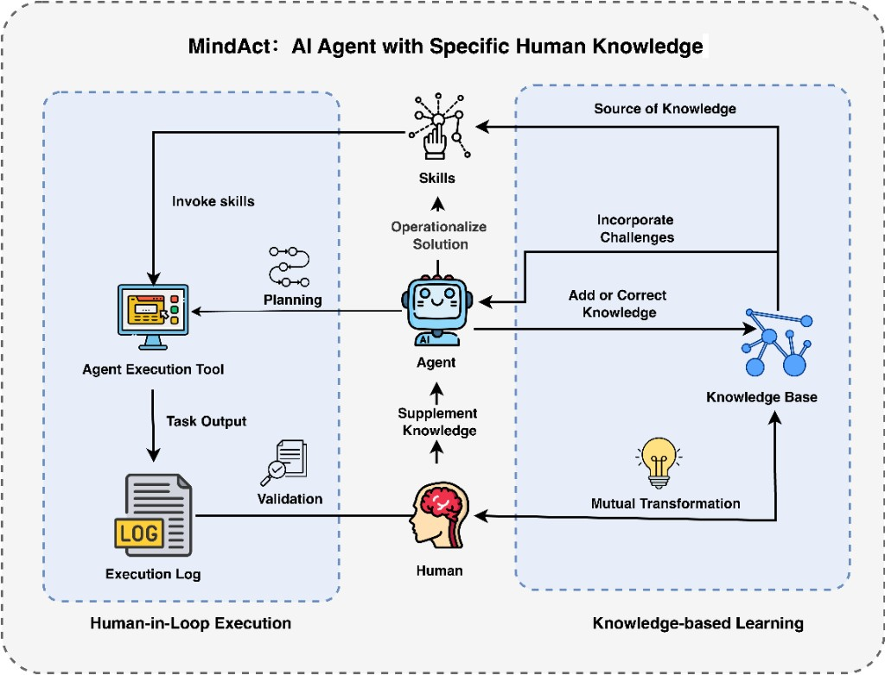
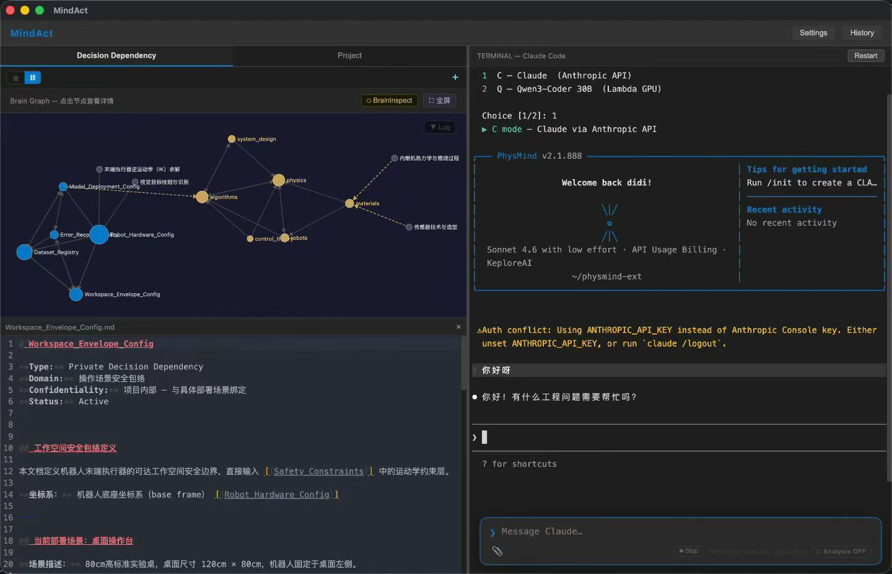
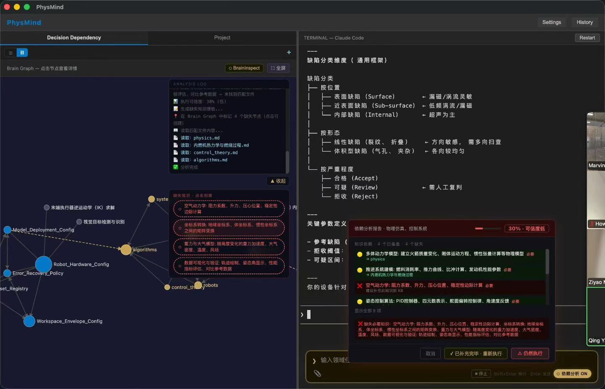

<div align="center">

<picture>
  <source media="(prefers-color-scheme: dark)" srcset="assets/mindact-logo-dark.png">
  <source media="(prefers-color-scheme: light)" srcset="assets/mindact-logo-light.png">
  
</picture>

[](https://docs.anthropic.com/claude-code)
[](https://github.com/KeploreAI-Lab/MindAct)
[](https://obsidian.md)
[](https://github.com/KeploreAI-Lab/MindAct)
[](https://github.com/KeploreAI-Lab/MindAct)
[](https://github.com/KeploreAI-Lab/physmind-cli-rust)
[](./LICENSE)

[](https://discord.gg/hpq9t4QQ)
[](https://github.com/KeploreAI-Lab/MindAct/stargazers)

[English](./README.md) | [中文文档](./README.zh.md)

</div>

> **From ReAct to MindAct.** [ReAct](https://arxiv.org/abs/2210.03629) (Reasoning + Acting) is the standard paradigm behind most AI agents — interleaving chain-of-thought reasoning with tool use. MindAct takes it further: before your agent acts, it checks what it knows, what it doesn't, and how confident it should be.

**MindAct** is a desktop AI workspace that combines a Claude Code terminal, a built-in Obsidian-style knowledge graph, and an intelligent Dependency Analysis engine — purpose-built for engineers working on domain-specific projects like robotics, physics simulation, and control systems.

<p align="center">
  
  <br>
  <em>MindAct: AI Agent with Specific Human Knowledge</em>
</p>

MindAct is built around two reinforcing loops. On the right, **Knowledge-based Learning**: humans bring in challenges and real-world experience, which get structured into a knowledge base — and that knowledge base in turn feeds back into how humans understand their domain. On the left, **Human-in-Loop Execution**: the agent uses that knowledge to plan and invoke skills, drives execution through tools, produces output and logs, and returns results to the human for validation. When something is wrong or missing, the human supplements knowledge directly back to the agent — and the cycle tightens.

Skills sit at the intersection: they are operationalized solutions distilled from knowledge, ready to be invoked. The system is designed so every execution makes the knowledge base more complete, and every addition to the knowledge base makes the next execution more reliable.

Think of MindAct like cooking:

- **Knowledge Base** = recipes, ingredient knowledge, and heat-control experience
- **Skill** = an executable cooking procedure module for a dish type
- **Execution Tool** = wok, stove, robot arm, or CLI tools
- **Agent** = the person/system that invokes the procedure and actually cooks

MindAct is knowledge-first: the primary goal is to accumulate, structure, and expand domain knowledge over time. Skills are a reuse layer on top of that knowledge, used to speed up repeated execution patterns.

<p align="center">
  
  <br>
  <em>MindAct desktop — Brain Graph (left) × Claude Code terminal (right)</em>
</p>

---

## Why MindAct?

Most AI coding assistants treat every task the same way: you type, it generates. That works for CRUD apps. It fails for domain-specific engineering.

**The problem:** Claude doesn't know your robot's joint limits, your motor controller's PID parameters, or your team's coordinate system conventions — unless you tell it every single time.

**The solution:** MindAct maintains a structured knowledge base linked to your project. Before every task, it runs a dependency analysis pipeline that checks what knowledge the task needs, what you already have, and what's missing. Then it enriches your prompt with the right context automatically.

```
❌  Before:  "Design a trajectory for the 6-DOF arm"
             → Claude guesses. Results vary. Debugging takes hours.

✅  After:   MindAct detects: robotics domain
             Finds: joint_constraints.md, workspace_config.md
             Missing: trajectory_algorithm.md  ← creates template for you
             Confidence: 72% Medium
             → Enriched prompt sent with full context injected
```

---

## What it does

```
User task → Skill Match (Stage 0) → (if miss) Dependency Analysis → Knowledge Retrieval → Enriched Prompt → Claude
```

**What you experience as a user (one task lifecycle):**

1. You type a task in the terminal.
2. MindAct checks whether an existing skill already fits this task.
3. If a skill is matched, you choose:
   - `Apply this Skill` (guided execution), or
   - `Without skill` (send original task directly).
4. If no skill is matched, MindAct runs dependency analysis and retrieval.
5. You get a report with:
   - covered dependencies,
   - missing dependencies,
   - confidence level (`High/Medium/Low`).
6. If AI output is uncertain (missing deps, broken chains, or low confidence), you fill or correct knowledge first.
7. MindAct helps you do that quickly via ghost-node templates and KB drafting.
8. After knowledge is improved, you re-run analysis, then Execute with stronger context.

**Core features:**

- **Claude Code terminal** — full interactive Claude Code session, embedded in the app
- **Knowledge-first workflow** — every task can feed back into your knowledge base and improve future tasks
- **Skill reuse layer** — reusable skills accelerate repeated tasks, but do not replace knowledge accumulation
- **Skills workspace** — dedicated `Skills` tab to browse/edit skill files under configured `skills_path`
- **Obsidian-style Brain Graph** — your knowledge base as a live, interactive `[[wiki-linked]]` graph. Nodes glow when they're relevant to your current task
- **Dependency Analysis engine** — 4-stage LLM pipeline that detects what your task needs, matches it against your KB, and scores confidence before execution
- **Ghost nodes** — missing dependencies appear as hollow red circles in the graph. Click one → get an AI-generated structured template to fill in
- **Streaming analysis log** — real-time SSE progress visible as a floating overlay on the graph, not a modal blocking your work
- **Context-enriched execution** — when you hit Execute, Claude receives your task plus all relevant KB content, automatically
- **Knowledge templates** — when knowledge is missing, MindAct generates a domain-specific template (not a blank file) so you know exactly what to write
- **Knowledge → Skill conversion** — convert validated knowledge into reusable skill drafts when repetition appears


---

## The intelligence behind it

MindAct builds a live knowledge graph from your `[[wiki-linked]]` markdown files, and that graph is what sets the retrieval layer apart. Rather than a flat similarity search, it combines lexical relevance, character n-gram semantic similarity, and structural proximity over wiki-links — so files that are both topically relevant and graph-connected to the strongest candidates rank higher. Query terms are also expanded through domain-specific vocabularies before retrieval, which means narrow engineering jargon finds the right files even when the exact wording doesn't match.

Dependencies are decomposed explicitly, not implied. If the initial pass comes back empty or too vague, the system fetches the most relevant files first and uses them as context to retry — a self-correcting loop that significantly reduces dead-end analysis on ambiguous prompts. The resulting matches are post-processed deterministically: coverage normalized, duplicates removed, gaps filled by local retrieval fallback, and results sorted stably. The same task produces the same analysis across runs.

Confidence is a weighted blend of dependency coverage, evidence quality measured by how closely retrieved content aligns with each dependency's description, and a noise penalty for missing items. Critical dependencies carry 3× the weight of optional ones. Beyond that, MindAct verifies whether critical dependencies form a connected chain in the knowledge graph — because having the right files isn't enough if they don't logically connect to each other. Broken chains are surfaced explicitly before execution, not discovered mid-run.

The design draws from [CRAG](https://arxiv.org/abs/2401.15884)'s evaluator-based retrieval correction, [GraphRAG](https://arxiv.org/abs/2404.16130)'s graph-structured evidence retrieval, and [Self-RAG](https://arxiv.org/abs/2310.11511)'s selective re-generation principle. Confidence scoring follows post-hoc calibration practices. The goal isn't theoretical completeness — it's making the output reliable enough to act on in engineering workflows where a wrong answer has real cost.

---

## From ReAct to MindAct

**[ReAct](https://arxiv.org/abs/2210.03629)** (Reasoning + Acting, Yao et al. 2022) is the paradigm behind most modern AI agents: interleave chain-of-thought *reasoning* with *tool actions* in a loop, so the model can plan, act, observe, and adjust. It's how agents like Claude Code work under the hood — think step-by-step, then call a tool, then reason about the result.

**MindAct** adds the missing layer: *structured domain memory*.

| | ReAct | MindAct |
|---|---|---|
| Reasoning | ✅ Chain-of-thought | ✅ Inherited |
| Acting | ✅ Tool use | ✅ Claude Code |
| **Domain memory** | ❌ Stateless | ✅ Knowledge graph |
| **Dependency awareness** | ❌ Implicit | ✅ Explicit pre-flight check |
| **Confidence scoring** | ❌ None | ✅ High / Medium / Low before execution |
| **Knowledge gap detection** | ❌ None | ✅ Ghost nodes + templates |

> ReAct asks: *"What should I do next?"*
> MindAct asks first: *"Do I have everything I need to do this right?"*

---

## Tech stack

| Layer | Technology |
|---|---|
| Desktop shell | Electron |
| Server / runtime | Bun |
| Frontend | React + Vite |
| Terminal | xterm.js + node-pty |
| Knowledge graph | D3.js force-directed (Obsidian-style `[[links]]`) |
| Code editor | CodeMirror 6 |
| AI | Anthropic Claude API (`claude-sonnet-4-6` / `claude-haiku-4-5`) |
| CLI | Rust ([physmind-cli-rust](https://github.com/KeploreAI-Lab/physmind-cli-rust)) |

---

## Project structure

```
mindact/
├── cli/                       # physmind CLI (git submodule → physmind-cli-rust)
│   └── rust/                  # Rust workspace — cargo build --release
├── setup.sh                   # One-shot setup: build CLI + install deps
├── restart.sh                 # Dev launcher: build client + start server + Electron
├── server.ts                  # Bun HTTP server (REST + SSE + WebSocket)
├── electron-main.cjs          # Electron main process
├── client/                    # React + Vite frontend
│   └── src/
│       ├── components/
│       │   ├── Terminal.tsx        # Claude Code terminal + analysis input
│       │   ├── KBPanel.tsx         # Knowledge base panel (决策依据)
│       │   ├── SkillsExplorer.tsx  # Skills panel (专家能力) — folder load UI
│       │   ├── FileExplorer.tsx    # Project files panel (项目文件)
│       │   ├── Graph.tsx           # Brain Graph (d3)
│       │   ├── GraphLogDrawer.tsx  # Analysis log overlay
│       │   └── DependencyReport.tsx
│       ├── graph_manager/          # D3 renderer, types, config
│       └── store.ts                # Zustand global state
├── decision_manager/          # AI analysis engine
│   ├── ai_client.ts           # Anthropic SDK wrapper
│   ├── build_index.ts         # Markdown graph indexer
│   ├── prompts/               # All LLM prompts (separated by task)
│   └── tasks/
│       └── dependency_analysis.ts  # 4-stage pipeline
└── tests/                     # Bun test suite (102 tests)
```

---

## Getting started

### Prerequisites

- [Bun](https://bun.sh) ≥ 1.0
- [Node.js](https://nodejs.org) ≥ 18 (for node-pty)
- [Rust + Cargo](https://rustup.rs) (to build the CLI)
- [Electron](https://electronjs.org)
- A KeploreAI key (`kplr-...`) — enter it in **Settings** after first launch

### Installation

```bash
git clone https://github.com/KeploreAI-Lab/MindAct
cd MindAct

# One-shot setup: install deps + build client
./setup.sh
```

`setup.sh` will:
1. Check / install **Bun** and **Node.js ≥18**
2. `bun install` all dependencies (root + client)
3. Build the React client → `client/dist/`
4. Check for the Claude CLI and print install instructions if missing

### Configuration

```bash
# Start the app
./restart.sh
```

On first launch, open **Settings** (top bar) and enter:
- **KeploreAI key** (`kplr-...`) — saved to `~/.config/physmind/credentials`
- **Vault path** — your private knowledge base folder
- **Project path** — working project directory opened in the terminal
- **Skills path** — folder of `.skill` files or unpacked skill directories

---

## Dependency Analysis

<p align="center">
  
  <br>
  <em>Dependency analysis — streaming log, ghost nodes (red dashed), and confidence report</em>
</p>

If no skill is matched, MindAct runs a pipeline that first identifies whether the task is domain-specific, then decomposes it into concrete knowledge dependencies — not vague categories, but specific modules like "joint angle constraints" or "sensor fusion algorithms". These dependencies are matched against your knowledge base using hybrid retrieval that combines lexical scoring, character n-gram semantic similarity, and graph proximity over `[[wiki-links]]`. If the first decomposition pass comes back weak, the system fetches top-ranked files as hints and retries — a self-correcting step that significantly reduces empty or misaligned results.

Confidence is then computed as a weighted blend of dependency coverage (critical items weighted 3×), evidence quality measured by token overlap between the retrieved content and the dependency description, and a noise penalty for uncovered or weakly covered items. This approach draws from CRAG's evaluator design and noise-aware confidence calibration work, producing a three-level output — **High / Medium / Low** — that reflects actual execution readiness rather than a raw percentage.

Beyond file presence, MindAct also checks whether the critical dependencies form a connected chain through the knowledge graph. A plan that has all the files but no logical continuity between them is caught here and flagged before execution.

When knowledge is missing, ghost nodes appear in the Brain Graph as hollow red circles. Clicking one opens a structured markdown template pre-filled with the specific fields that dependency requires — not a blank file, but a guided scaffold tied to your task context. This is the primary way MindAct guides users to expand their knowledge base deliberately rather than randomly.

---

## Knowledge Base

MindAct works with plain markdown files. The Brain Graph is built from cross-references between files and updates live.

Two KB types:
- **Private** — your own files, editable, stored in your vault path
- **Platform** — read-only reference modules (physics, algorithms, robots, etc.) installable from the platform library

### Link syntax

MindAct uses two linking conventions that drive the Brain Graph and dependency analysis:

| Syntax | Meaning | Example |
|--------|---------|---------|
| `[[filename]]` | Link to a **private** KB file | `[[joint_constraints]]` |
| `{{filename}}` | Cross-link to a **platform** KB module | `{{Safety_Constraints}}` |

`[[wiki links]]` work exactly like Obsidian — use the filename without the `.md` extension. The graph traversal engine resolves both link types during dependency analysis, so a private file can declare that it depends on a platform module via `{{}}`, and the coverage checker will follow the chain across both KB layers.

**Example private KB entry:**

```markdown
# Joint Angle Constraints

Our 6-DOF arm has the following joint limits: ...

## Related
- [[workspace_config]]         ← links to another private file
- {{Safety_Constraints}}       ← cross-links to platform module
```

---

## Examples

The `examples/` directory contains a ready-to-use sample workspace for a robotics / computer vision project:

```
examples/
├── knowledge-base/
│   ├── private/          # Domain-specific private KB (physics, control, embodied AI)
│   │   ├── continuum_mechanics.md
│   │   ├── control_dynamics.md
│   │   ├── electromagnetism_maxwell.md
│   │   └── ...
│   └── platform/         # Read-only platform reference modules
│       ├── Action_Space_Definition.md
│       ├── Inference_Latency_Budget.md
│       ├── Safety_Constraints.md
│       └── ...
└── skills/               # Reusable skill modules (.skill archives unpacked)
    ├── cv-dataset-analyzer/SKILL.md
    ├── halcon-python-api-bridge/SKILL.md
    ├── model-deployment-profiler/SKILL.md
    ├── yolov8-industrial-finetune/SKILL.md
    └── ...
```

To use the examples, open **Settings** and set:
- **Vault path** → `<repo>/examples/knowledge-base/private`
- **Project path** → your own project directory
- **Skills path** → `<repo>/examples/skills`

---

## Running tests

```bash
bun test tests/              # full suite (102 tests)
bun test tests/decision_manager/
bun test tests/graph_manager/
bun test tests/api/          # requires running server
```

---

## Environment variables

| Variable | Required | Description |
|---|---|---|
| `KPLR_KEY` | Yes | KeploreAI key (`kplr-...`). Set via Settings UI — saved to `~/.config/physmind/credentials` |
| `CLAUDE_BIN` | No | Override path to the CLI binary (default: auto-detected from `PATH`) |

---

## Roadmap / TODO

### Skill ↔ Knowledge closed-loop (needs design)

Currently, when no matching skill is found, the system falls back to KB dependency analysis and surfaces a manual "Distill to Skill" button. The ideal closed loop would be:

1. **No skill match** → agent proactively tells the user *which knowledge is missing* to solve the task
2. User supplements the KB (or ghost-node templates guide them)
3. Agent **automatically generates a SKILL.md** from the enriched KB, saves it to `skills_path`, and syncs to `~/.physmind/skills/`
4. Next time the same task type appears → Stage 0 hits the new skill directly

Key design questions to resolve:
- When should auto-generation trigger vs. waiting for explicit user confirmation?
- How to evaluate whether the generated skill is "good enough" before saving?
- Should the agent ask clarifying questions in the terminal, or surface a structured form in the UI?

---

## License

AGPL-3.0

---

<p align="center">
  Built by <a href="https://github.com/KeploreAI-Lab">KeploreAI Lab</a> · <a href="https://discord.gg/hpq9t4QQ">💬 Join our Discord</a>
</p>
